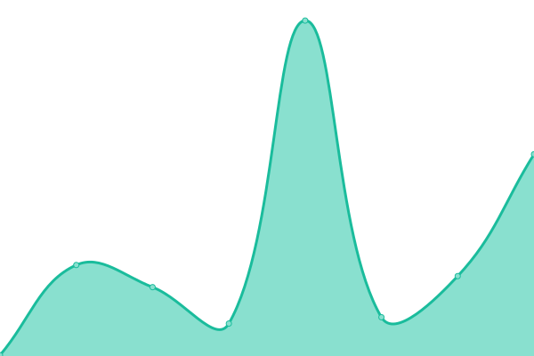

# [📈 Live Status](https://status.ihateani.me): <!--live status--> **🟧 Partial outage**

This repository contains the open-source uptime monitor and status page for [ihateani.me](https://ihateani.me), powered by [Upptime](https://github.com/upptime/upptime).

With [Upptime](https://upptime.js.org), you can get your own unlimited and free uptime monitor and status page, powered entirely by a GitHub repository. We use [Issues](https://github.com/ihateani-me/status/issues) as incident reports, [Actions](https://github.com/ihateani-me/status/actions) as uptime monitors, and [Pages](https://status.ihateani.me) for the status page.

<!--start: status pages-->
<!-- This summary is generated by Upptime (https://github.com/upptime/upptime) -->
<!-- Do not edit this manually, your changes will be overwritten -->
<!-- prettier-ignore -->
| URL | Status | History | Response Time | Uptime |
| --- | ------ | ------- | ------------- | ------ |
|  [ihateani.me [api]](https://api.ihateani.me/echo) | 🟩 Up | [ihateani-me-api.yml](https://github.com/ihateani-me/status/commits/HEAD/history/ihateani-me-api.yml) | 

 530ms
     
 | 

<a href="https://status.ihateani.me/history/ihateani-me-api">100.00%</a>
    

|  [ihateani.me [cdn]](https://p.ihateani.me/) | 🟩 Up | [ihateani-me-cdn.yml](https://github.com/ihateani-me/status/commits/HEAD/history/ihateani-me-cdn.yml) | 

 543ms
     
 | 

<a href="https://status.ihateani.me/history/ihateani-me-cdn">100.00%</a>
    

|  [ihateani.me [git]](https://git.ihateani.me/) | 🟥 Down | [ihateani-me-git.yml](https://github.com/ihateani-me/status/commits/HEAD/history/ihateani-me-git.yml) | 

 374ms
     
 | 

<a href="https://status.ihateani.me/history/ihateani-me-git">100.00%</a>
    

|  [ihateani.me [web]](https://ihateani.me/) | 🟩 Up | [ihateani-me-web.yml](https://github.com/ihateani-me/status/commits/HEAD/history/ihateani-me-web.yml) | 

 125ms
     
 | 

<a href="https://status.ihateani.me/history/ihateani-me-web">100.00%</a>
    

|  [VTHell [api]](https://mizore.ihateani.me/vthell) | 🟥 Down | [vt-hell-api.yml](https://github.com/ihateani-me/status/commits/HEAD/history/vt-hell-api.yml) | 

 858ms
     
 | 

<a href="https://status.ihateani.me/history/vt-hell-api">0.00%</a>
    

|  [VTHell [web]](https://vthell.ihateani.me/) | 🟥 Down | [vt-hell-web.yml](https://github.com/ihateani-me/status/commits/HEAD/history/vt-hell-web.yml) | 

 0ms
     
 | 

<a href="https://status.ihateani.me/history/vt-hell-web">0.00%</a>
    

<!--end: status pages-->

[**Visit our status website →**](https://status.ihateani.me)

## 📄 License

- Powered by: [Upptime](https://github.com/upptime/upptime)
- Code: [MIT](./LICENSE) © [ihateani.me](https://ihateani.me)
- Data in the `./history` directory: [Open Database License](https://opendatacommons.org/licenses/odbl/1-0/)
